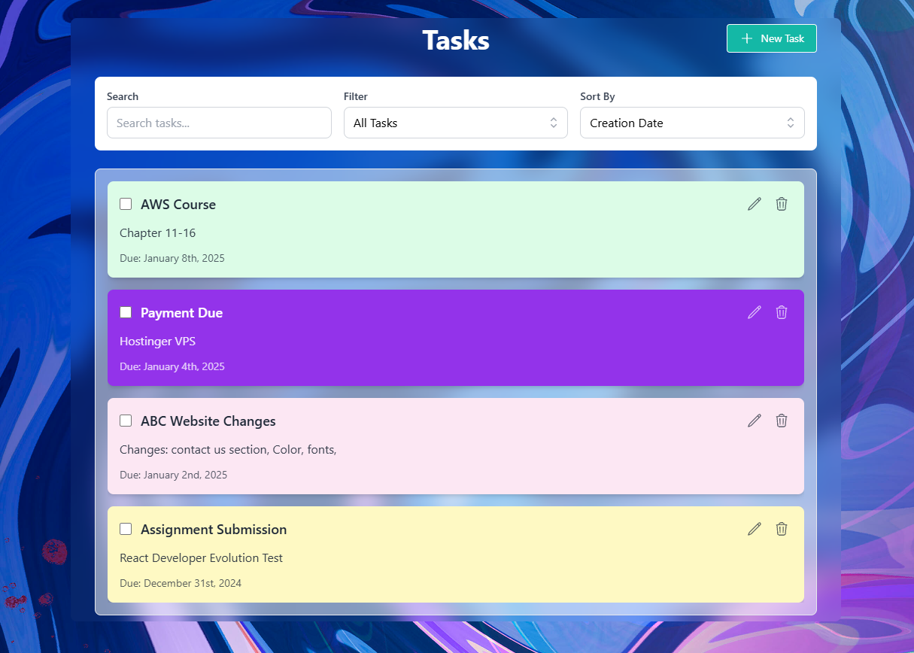

# TaskManagement - System

TaskManagement is a sleek and modern task management application designed to help users organize and track their tasks efficiently with a beautiful user interface.

<p align="center">
  
</p>

## Key Features

### Task Management

- Add new tasks with title, description, and due date
- Edit existing tasks
- Delete tasks
- Mark tasks as complete/incomplete
- Colorful task cards with dynamic color schemes

### Filtering and Sorting

- Filter tasks by status (All/Completed/Pending)
- Search tasks by title or description
- Sort tasks by due date or creation date
- Real-time filtering and sorting

### User Interface

- Clean and modern design
- Responsive layout for all screen sizes

## Technologies Used 

- React.js
- TypeScript
- Redux Toolkit for state management
- Tailwind CSS for styling
- Headless UI for accessible components
- Hero Icons for beautiful icons
- Date-fns for date formatting
- UUID for unique identifiers
- Photoshop for favion and background image adjustment

## Setup

1. Clone the repository:
```git clone https://github.com/rohanvron2/TaskManagement.git```
```cd TaskManagement```

2. Install dependencies:
```npm install```

## Running the Application

- In a terminal:
```npm run dev```

3. Open your browser and navigate to `http://localhost:5173/` to view the application.

## Local Storage

- The application uses browser's local storage to persist tasks, ensuring your data remains available between sessions.